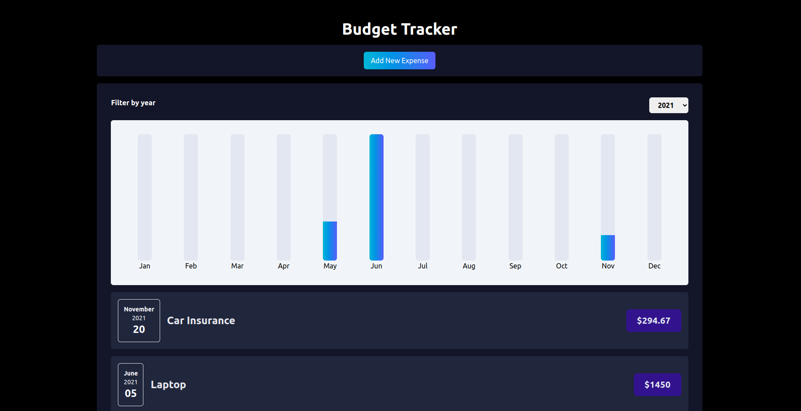

# Getting Started with the Expense Tracker

This is a single page expense tracker applicationthat takes different information about your particular expense; title, date and amount. It displays it in rich UI format

So to open the input , you click on the "Add New Expense" button

