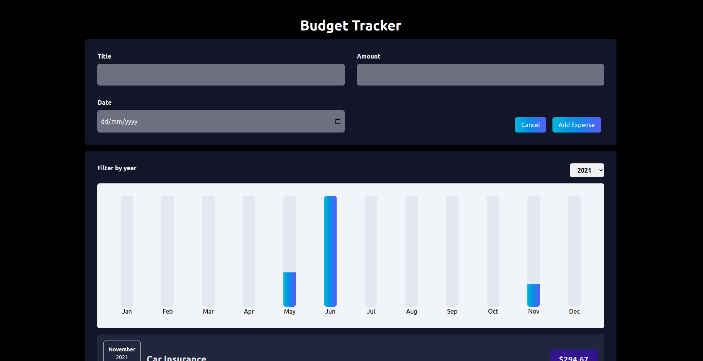

# Getting Started with the Expense Tracker

This is a single page expense tracker applicationthat takes different information about your particular expense; title, date and amount. It displays it in rich UI format

So to open the input , you click on the "Add New Expense" button

When clicked, it opens a modal where you can input data; title ,date and amount. After inputing value in any input, use the tab key to focus on the next, or manually move your cursor to the next input.

